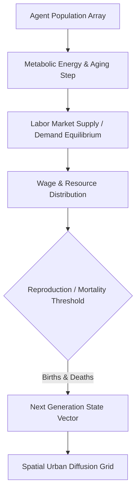

# 👥 Population Game — Multi-Agent Demographic & Economic Equilibrium Simulator

An agent-based demographic simulation modeling multi-generational population dynamics, resource competition, labor market equilibria, and spatial urban migration across cellular automata grids.

---

## 🏛️ Simulation Loop & Multi-Agent Flow

---

## 🔬 Core Capabilities

1. **Micro-Economic Price Discovery:** Walrasian auctioneer equilibrium solving for commodity prices based on agent marginal utility.
2. **Cellular Migration Diffusion:** Voronoi-weighted geographic gravity models driving rural-to-urban urbanization waves.
3. **Multi-Generational Genetics:** Trait inheritance, fertility hazard rates, and age-structured cohort survival matrices.

---

### 👨‍💻 Engineering Syndicate & Authors
- **Жирняк (Jirnyak)** — Lead Demographic Physicist & Macro-Economic Systems.  
  GitHub: [@Jirnyak](https://github.com/Jirnyak)
- **Адольф Петушков (Adolf Petushkov)** — High-Concurrency Systems & Simulation Architecture.  
  GitHub: [@marko1olo](https://github.com/marko1olo)
