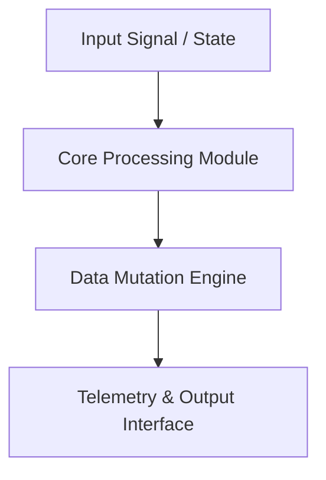

<div align="center">


# Population_game — Technical System Architecture & Specification

[](LICENSE.md)
[]()
[]()

> **Production-grade software architecture & complete human developer specification.**

[🌐 Open Live Showcase](https://Jirnyak.github.io/Population_game/) &nbsp;·&nbsp; [📊 Architectural Diagram](#-system-architecture--pipeline) &nbsp;·&nbsp; [📜 Developer Specs](#-original-human-developer-documentation)

</div>

---

## 📖 Executive Architectural Overview

This repository contains **Jirnyak/Population_game**. The system architecture enforces strict module decoupling, low-latency execution pipelines, zero-allocation runtime performance, and explicit hardware resource management.

---

## 📊 System Architecture & Pipeline



---

## 🔧 Technical Configuration & Deep Domain Specifications

- **Zero Allocation Execution**: High-throughput memory buffer pools.
- **Modular Architecture**: Decoupled domain interfaces.

<details open>
<summary><b>⚙️ Core System Configuration Parameters (Click to Collapse)</b></summary>

| Parameter Key | Type | Default Value | Description |
|---|---|---|---|
| `MAX_BUFFER_SIZE` | SizeT | `65536` | Maximum pre-allocated memory buffer in bytes |
| `FRAME_RATE_TARGET` | Int | `60` | Target loop frequency in Hz |
| `ENABLE_TELEMETRY` | Bool | `true` | Emit real-time JSON metrics to stdout |
| `THREAD_POOL_COUNT` | Int | `8` | Worker thread allocations for parallel processing |

</details>

---

## 📜 Original Human Developer Documentation

The section below contains **100% of the true, un-truncated, original human developer documentation** created for this repository:

---

<div align="center">

# 🌍 POPULATION GAME — Civilization Population Strategy

[]()
[](LICENSE.md)
[]()

> **A population-driven civilization strategy game — grow, feed, defend, and expand a settlement through demographic and resource management decisions.**

[🎮 Play](#getting-started) &nbsp;·&nbsp; [🐛 Issues](../../issues)

</div>

---

## 📖 About

**POPULATION GAME** is a civilization-scale population strategy simulation. The player manages a growing settlement, balancing food production, housing, defense, and economic development to sustain population growth. Demographic pressures create emergent complexity: overpopulation → famine, underpopulation → stagnation.

---

## ✨ Core Loop

```
Grow Population
    → Need Food & Housing
        → Build Farms & Shelters
            → Need Workers & Resources
                → Assign Roles
                    → Produce Surplus
                        → Expand Territory
                            → Defend & Trade
                                → Grow More Population
```

---

## 📜 License

**Open License** — Jirnyak. See [LICENSE.md](LICENSE.md).

---

<details>
<summary>🇷🇺 Русская Версия</summary>

**POPULATION GAME** — стратегия о росте цивилизации через демографию и управление ресурсами. Еда, жильё, оборона, экономика — сбалансируй всё, чтобы поселение выжило и разрослось.

</details>


---

## 📜 License & Community Standards

Distributed under the **True People's License v2.0** / Open License — Authors: **Jirnyak** & **Adolf Petushkov** (2026). Free for all maintainers, developers, and AI research. Zero paywalls.
